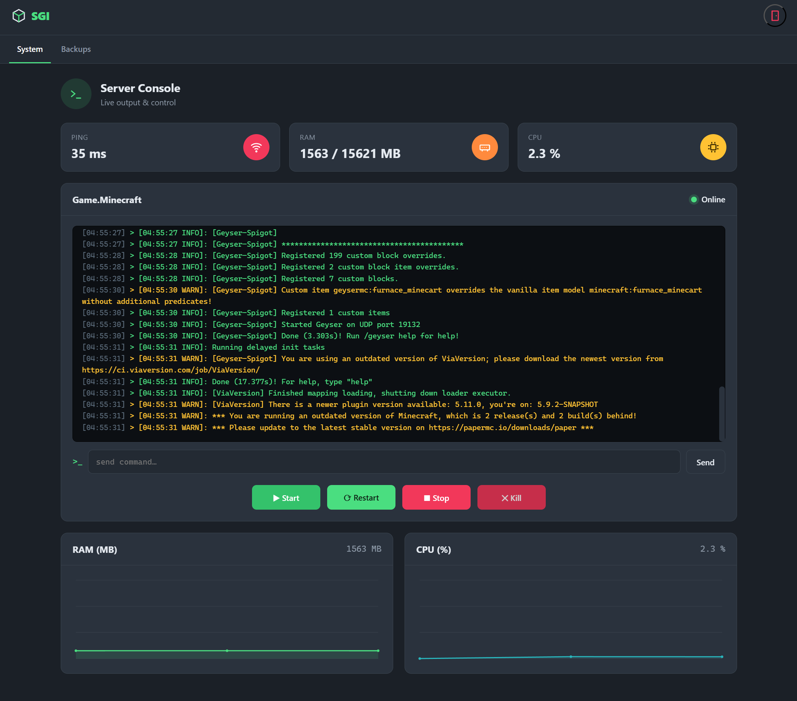
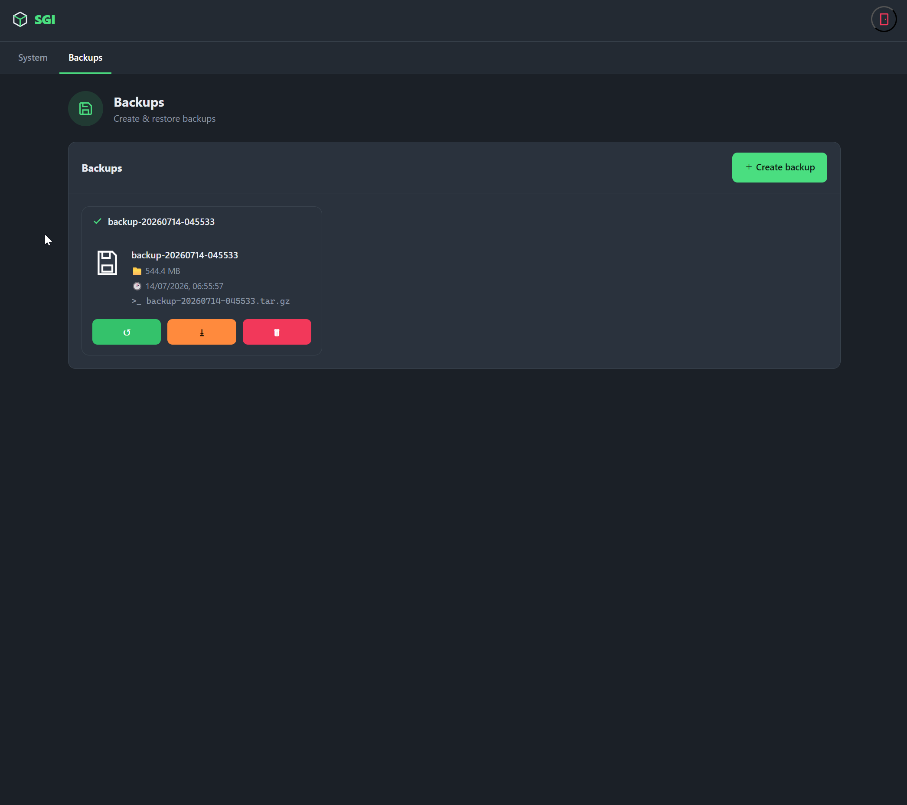

# SGI — Simple Game Interface

A minimal, **stateless** game-server panel. Game servers run as Docker
containers; SGI manages them (start/stop/restart/kill, live console, backups)
and itself runs in Docker, talking to the host Docker engine over the socket.

See [KONZEPT.md](KONZEPT.md) for the full design and [TODO.md](TODO.md) for status.

## Screenshots

**Server Console** — live log output, command input, power controls and RAM/CPU sparklines:



**Backups** — create, restore, download and delete backups per server:



---

- **No database, no sessions.** All data comes from the Docker runtime and the
  backup folder at request time.
- **Token login.** The server token is a Docker **label** on the game container
  (`sgi.token=<token>`); one token maps to exactly one container. The backend
  resolves the container from the token on every request — the client never
  sends a container id.
- **PHP 8.3 + Apache**, no external PHP dependencies (`ext-curl` is bundled).

---

## Quick start

```bash
# 1. Create the shared backup volume (once).
docker volume create sgi_backup

# 2. Build & run SGI (serves on http://localhost:8080).
docker compose up -d --build
```

SGI expects to sit behind a reverse proxy that terminates TLS; the container
speaks plain HTTP on port 80 (published as 8080).

## Registering a game server

Start a game container with the SGI labels and the shared backup volume:

```bash
TOKEN=$(openssl rand -hex 16)
docker run -d -i --name mc \
  -l sgi.token=$TOKEN \
  -l sgi.name="My Minecraft" \
  -l sgi.backup.path=/data \
  -v mc_data:/data \
  -v sgi_backup:/backup \
  itzg/minecraft-server
```

Then open SGI and sign in with `$TOKEN`.

### Labels

| Label             | Required | Meaning                                                                 |
|-------------------|:--------:|-------------------------------------------------------------------------|
| `sgi.token`       |    ✅     | Secret server token = login for this one container.                     |
| `sgi.name`        |    –     | Display name (falls back to the container name).                        |
| `sgi.backup.path` |    –     | Path **inside the game container** to back up (e.g. `/data`). Falls back to the first named-volume mount. |

### Requirements for full functionality

- **stdin open** (`-i` / `stdin_open: true`, `tty: false`) → console commands
  via `docker attach`.
- Game data in a **volume or bind-mount** → backups.
- The **`sgi_backup`** volume mounted at `/backup` in the game container →
  shared backup storage.

---

## API

All endpoints require `Authorization: Bearer <token>` (downloads may instead
pass `?token=<token>` because they open in a new browser tab).

| Method | Path                          | Purpose                                  |
|--------|-------------------------------|------------------------------------------|
| GET    | `/api/status`                 | Live status (inspect + stats).           |
| POST   | `/api/start\|stop\|restart\|kill` | Power actions.                        |
| GET    | `/api/console?after=<seq>`    | Incremental log output.                  |
| POST   | `/api/command`                | Write `{command}` to container stdin.    |
| GET    | `/api/backups`                | List backups.                            |
| POST   | `/api/backups`                | Create a backup.                         |
| POST   | `/api/backups/<id>/restore`   | Restore a backup.                        |
| GET    | `/api/backups/<id>/download`  | Download a backup file.                  |
| DELETE | `/api/backups/<id>`           | Delete a backup.                         |

`<seq>` is an opaque cursor (a log timestamp) — the server is stateless, the
client echoes back the `last` value from the previous response.

---

## How it works

- **Status/resources** — `docker inspect` (online, uptime, image) +
  `docker stats` (RAM, CPU%). Game metrics (`ping`, `players`) are not exposed
  by Docker and show as `—`.
- **Console** — `docker logs` with timestamps as the cursor; input is written to
  stdin via a raw-socket `docker attach` (needs `-i`).
- **Backups** — an ephemeral `alpine` helper reads the game data via
  `--volumes-from` and writes a `.tar.gz` into the shared `sgi_backup` volume at
  `/backup/<token>/`. SGI mounts that volume itself, so list/download/delete are
  plain filesystem operations, hard-clamped to the logged-in token's folder.

## Security notes

- The token protects **web** access, not host access — anyone with Docker access
  on the host can read labels. Use long, random tokens (32+ chars).
- **TLS is out of scope**; run behind a TLS-terminating reverse proxy.
- Mounting `docker.sock` grants the container full control of the host Docker
  engine. Treat the SGI host as trusted infrastructure.
